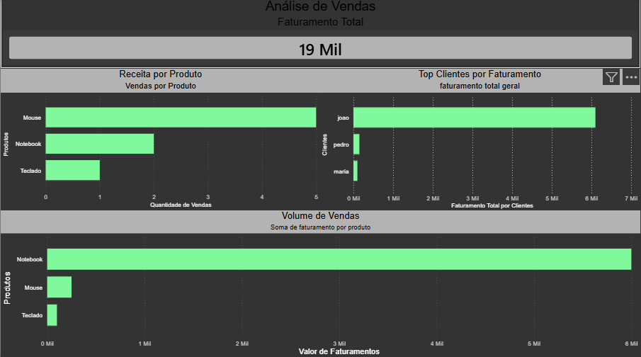

# 📊 Análise de Vendas com SQL e Power BI

## 📌 Sobre o projeto

Este projeto analisa dados de vendas com o objetivo de identificar padrões de faturamento, produtos mais relevantes e comportamento de clientes.

---

## 🛠️ Ferramentas utilizadas

* SQL
* Power BI
* Excel

---

## 📊 Análises realizadas

* Faturamento total por cliente
* Faturamento por produto
* Quantidade vendida por produto

---

## 📈 Insights

* O produto Notebook é responsável pela maior parte do faturamento
* O produto Mouse possui maior volume de vendas
* Existe concentração de receita em poucos clientes

---

## 📷 Dashboard

---

## 🧠 Aprendizados

* Uso de JOIN entre múltiplas tabelas
* Aplicação de SUM e GROUP BY
* Criação de dashboards no Power BI
